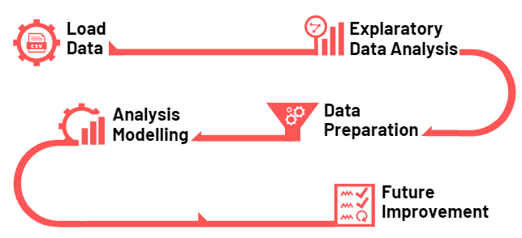
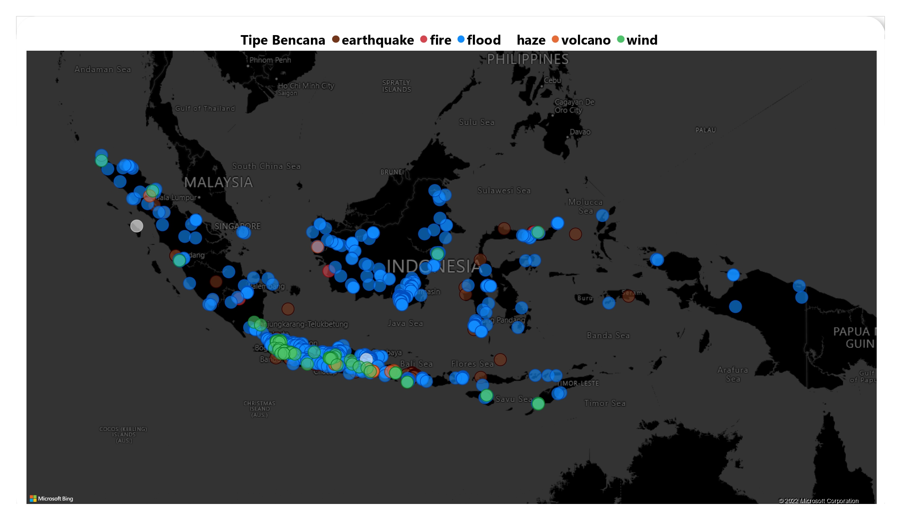
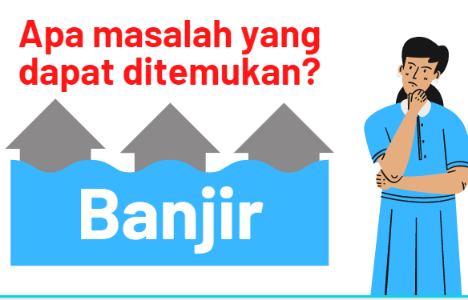
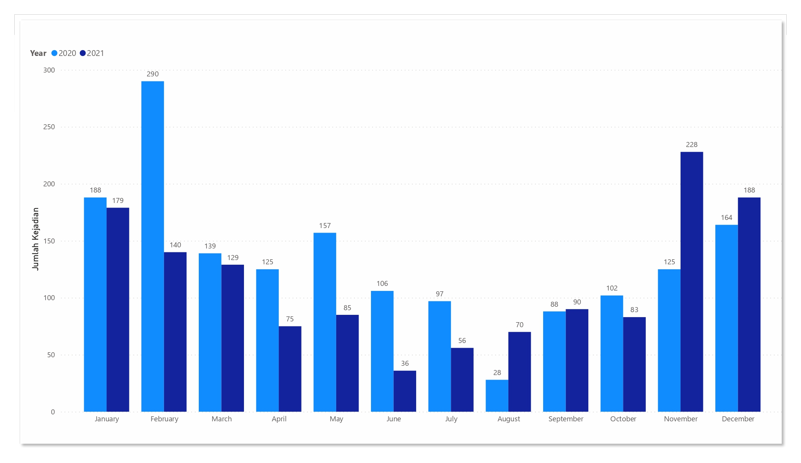
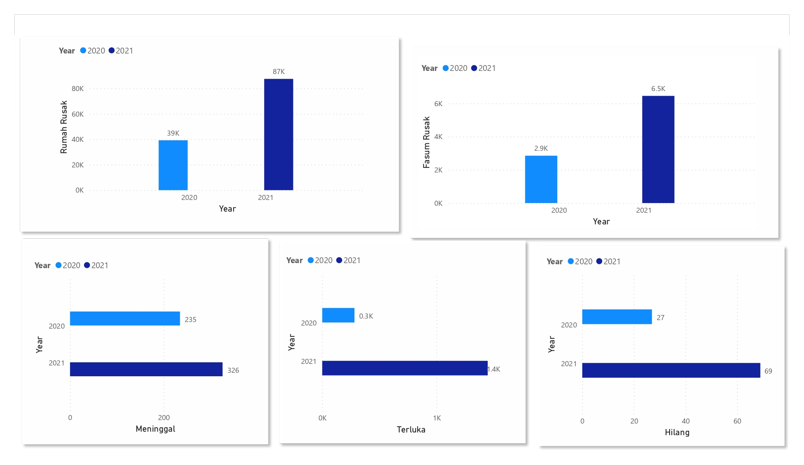
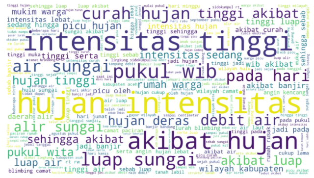
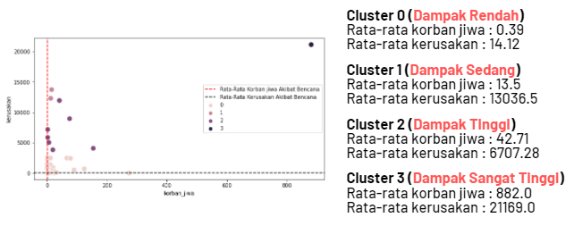

# Capstone-Project Title  Get Insight From Natural Disaster Report Data
Powered by **PetaBencana** &amp; **BNPB**: Badan Nasional Penanggulangan Bencana

  
  &nbsp;&nbsp;&nbsp;
  

### Members:
* Husni
* Tony Wijaya
* Andre
* Resti
### Mentor
* Rusnandi Fikri

### Meta Data
- https://gis.bnpb.go.id/
- https://docs.petabencana.id/

### Apa itu Peta Bencana?
PetaBencana.id adalah platform gratis berbasis website yang menghasilkan visualisasi bencana dalam skala perkotaan menggunakan laporan hasil crowdsourcing dan validasi instansi pemerintah secara real time. Platform ini memanfaatkan penggunaan sosial media dan aplikasi pesan instan untuk mengumpullkan informasi terbaru yang terkonfirmasi dari pengamatan secara langsung, dan dengan demikian menghilangkan kebutuhan pemrosesan data yang memakan waktu dan biaya. PetaBencana.id juga telah diadopsi oleh Badan Nasional Penanggulangan Bencana (BNPB) untuk memantau kejadian banjir, meningkatkan waktu tanggap, dan berbagi informasi darurat waktu kritis dengan warga. Platform ini telah memungkinkan berbagi informasi dan koordinasi data yang lebih besar di antara penduduk dan lembaga pemerintah, mendorong ketahanan yang adil dan kolaboratif terhadap perubahan iklim.

### Step Pengolahan Data

#### Load Data
* Tools Used
  * Python
  * Github
  * Microsoft Excel
  * Microsoft Power BI
* Dataset
  * Peta Bencana (4235 Row, 21 Column)
  * BNPB (2986 Row, 14 Column)  

#### Explanatory Data Analysis
* Jenis Bencana
  * Banjir
  * Gempa Bumi
  * Gunung Api
  * Kabut Asap
  * Angin Kencang
  * Kebakaran Hutan  
* Titik Lokasi
  * 
* Problem yang Ditemukan
  * 

#### Data Preparation
* What we do in preparation
  * Data Cleaning
    * Replace missing value
    * Remove duplicate data
    * Change datatype
    * Text cleaning
    * Dealing incorrect longitude & latitude 
  * Feature Engineering 
    * Made disaster type column
    * Made date time column
    * Generate longitude & latitude 
  * Feature Selection 
    * Eliminate unusefull feature 
* Before after cleaning
  * Peta Bencana 
    * Before (4235 rows, 21 columns)
    * After (4208 rows, 9 columns)
  * BNPB
    * Before (2968 rows, 14 columns)
    * After (2968 rows, 12 columns)  

#### Analysis & Modelling
* Timeline & impact analysis
  * 
  * 
* Text analysis
  * 
* Machine learning model
  * 

#### Future Improvement
* Things to improve
  * Clustering dapat dilakukan pada tipe bencana lainnya bila datanya memungkinkan.  Selanjutnya clustering dapat terus disempurnakan dengan cara menambah data bencana dari tahun sebelum 2020 maupun sesudah 2021. 
* Recomendation
  * Daerah-daerah yang masuk ke cluster 1,2, dan 3 dapat menjadi prioritas pemerintah dalam usaha perbaikan pasca bencana
  * Kami merekomendasikan setiap stakeholder yang berkaitan dalam penanggulangan bencana untuk saling bekerjasama, khususnya dalam melakukan penyeragaman data dan  kebijakan satu data. 

